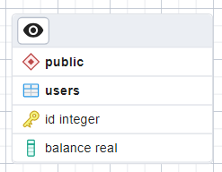

# API For Internet Banking

Функционал:
- [x] База данных
- [x] Работа с базой данных
- [x] REST API
- [X] Метод getBalance работает корректно 
- [X] Метод takeMoney работает корректно
- [X] Метод putMoney работает корректно
- [X] Метод getOperationList работает корректно
- [X] Метод transferMoney работает корректно
- [X] Ответ выдается в JSON
- [X] Настройки подключения к базе данных хранятся в отдельном файле
- [X] Сделан dump базы данных
- [X] Прикреплена текущая схемы базы данных
- [X] Обработка отрицательного баланса
- [X] Транзакции
- [X] Перевод денег от одного пользователя к другому
- [X] Деплой Rest API
- [X] Юнит-тесты
- [X] Логирование операций

Текущая схема базы данных (ERD):  

Описание API:
- **/users/{userId}/getBalance** - где userId = код пользователя. Вовзращает баланс пользователя по его коду.
- **/users/{userId}/putMoney** - где userId = код пользователя, amount = сумма. Пополняет баланс пользователя по его коду на определенную сумму.
- **/users/{userId}/takeMoney** - где userId = код пользователя, amount = сумма. Снимает баланс пользователя по его коду на определенную сумму.
- **/users/{userId}/getOperationList** - где userId = код пользователя, startDate = начальная дата, endDate = конечная дата. Выводит список операций, как по дате, так и без дат. В качестве даты используется timestamp.
- **/users/{fromUserId}/transferMoney** - где fromUserId и toUserId = коды пользователей, amount = сумма. Снимает баланс from пользователя по его коду на определенную сумму и пополняет баланс to пользователя по его коду на определенную сумму.

Проверить работу Rest API вы можете по адресу **85.92.110.214:8080**
